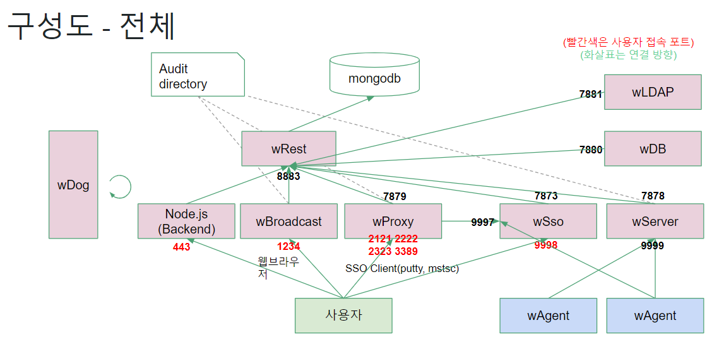
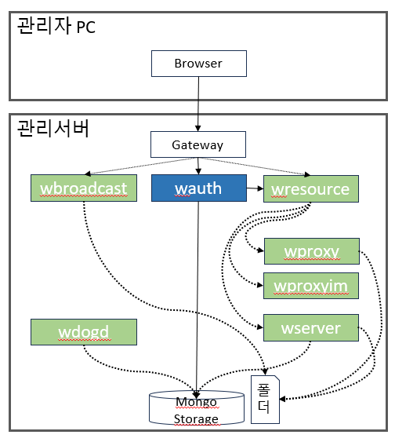

# 설계(구조)
<br/>

### wauth 역할
  + 인증과 권한을 담당하는 프로세스
  + 인증대상: 관리자, 사용자, API토큰
<br/>

### wauth구성
  + package 구성
    + main 패키지
    + "github.com/acrav3/wauth/usermanager" 패키지
    + ...
    + "github.com/acrav3/wauth/admininboxmanager" 패키지
  + 
  + libinfo/libinfo.go
    + 모든 구조체를 정의한 함수
<br/>

### manager 형식
  + 싱글톤 패턴보다는 js의 모듈 패턴
  + 모듈 패턴
    - 모듈이란 전체 애플리케이션 중 일부를 독립된 코드로 분리해서 만들어 놓은 것. 유용한 기능을 모아둔 것
    - 캡슐화, 생성자함수 제공, 잘 구조화된 코드를 지원하기 위해 느슨한 결합을 제공
    - 싱글톤과는 다르게 여러 개의 인스턴스를 생성할 수 있음(ACRAd에서는 대부분 하나의 인스턴스만 생성)
    - 객채지향
  + new()로 초기화
  + manager.함수이름()으로 호출 가능
    ```go
    package main

    import "github.com/acrav3/wauth/adminmanager"

    adminMgr, err = adminmanager.New(ctx, logging, client, AESKey)
    if err != nil {
      logging.Fatalln(err)
    }
    ```
	- manager.List()
    ```go
    people, err := adminMgr.List(r.Context(), query, fields, sort, max)
    if err != nil {
      logging.Errorln(err)
    }
    ```
	- manager.Create()
    ```go
    old, new, err := adminMgr.Create(r.Context(), req, REGULATION)
    if err != nil {
    	logging.Errorln(err)
    }
    ```
	- manager.Update()
    ```go
    old, new, err := adminMgr.Update(r.Context(), req, true)
    if err != nil {
    	logging.Errorln(err)
    }
    ```
	- manager.Delete()
    ```go
    old, new, err := adminMgr.Delete(r.Context(), req.ID)
    if err != nil {
    	logging.Errorln(err)
    }
    ```
<br/>

### 동적 라이브러리
  + Cgo를 사용해서 C/C++ 라이브러리를 호출 가능
  + 플러그인 방식 (.so .dll)
    - go build -buildmode=plugin -o libonline.so
  + wauth에는 libonline / liboffline / libapplication / libpki(Cgo) 가 있음
<br/>


### 명명규칙 
  + Go 일반 변수, 함수 이름 규칙: camelCase (각 단어의 첫문자를 대문자로 표기하고 붙여쓰되, 맨처음 문자는 소문자로 표기함)
  + Go 구조체 및 구조체 변수, 함수 이름: PascalCase (첫 단어를 대문자로 시작하는 표기법)
  + Go 파일, 폴더 이름 규칙: 소문자만
  + Go 패키지 이름 규칙: 소문자만
<br/>

### V2.4 구성도
  + 인증을 담당하는 프로세스가 없음
  + REST가 인증을 담당하는 동시에 API서버 역할을 함<br/>
  
<br/>

### V3 구성도
  + 인증을 담당하는 프로세스가 있음<br/>
  

### V3 프로세스별 기능
| 종류 | 프로세스 | 기능 |
| ---- | ------ | ----------- |
| 관리서버 | wdogsd | 이중화 서버 프로세스 관리 (자식프로세스: wdogd) |
| 관리서버 | wdogd | 단일 서버 프로세스 관리 (자식프로세스: 아래목록) |
| 관리서버 | wauth | 인증 API 제공 프로세스 (관리자,사용자 인증 및 관련기능) |
| 관리서버 | wresource | 자원 API 제공 프로세스 (노드, 계정 등) |
| 관리서버 | wlifecycle | 수명주기 작업실행 프로세스 |
| 관리서버 | wbroadcast | 녹화영상 재생 프로세스 |
| 관리서버 | wtrigger | 데이터정합성 관리 및 외부연동 프로세스 |
| 관리서버 | wserver | 관리대상서버 에이전트 관리 프로세스 |
| 관리서버 | wproxy | 관리대상서버 프록시 접근통제 프로세스 |
| 관리서버 | wproxyim | 관리대상서버 프록시 계정관리 프로세스 |
| 관리서버 | wmail | 이메일 발송 프로세스 |
| 관리서버 | waccess | 접속기 운영관리 프로세스  |
| 관리서버 | wtunnel | 접속기 통신관리 프로세스 |
| 관리서버 | whttpsproxy | 관리대상웹서버 접근통제 프로세스 |
| 관리대상서버 | wagent  | 에이전트 프로세스 |
| 접속기 | ACRA Point.exe | PC 사용자 클라이언트 프로그램 |
<br/>